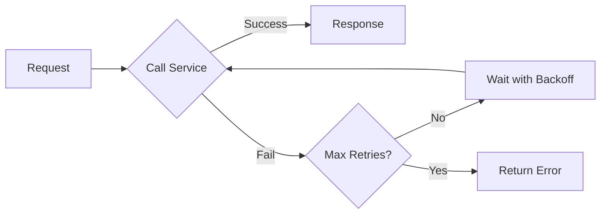

# Dapr Resiliency Configuration

## Task 6A.4: Create Dapr Resiliency Configuration

**Date**: 2026-02-20  
**Status**: ✅ Completed

**Requirements Validated**: 20.1, 20.2, 20.3

---

## Summary

Successfully created and deployed the Dapr resiliency configuration for the FEAF Dashboard. The resiliency component provides retry policies, timeout policies, and circuit breaker policies to handle transient failures and prevent cascading failures in distributed systems.

## What Was Accomplished

### 1. Created Resiliency Configuration Manifest

**File**: `k8s/11-dapr-resiliency.yaml`

- Resource name: `feaf-resiliency`
- Namespace: `feaf-dashboard`
- Type: `dapr.io/v1alpha1` (Resiliency)

**Configuration Components**:

#### Retry Policies

Three retry policies with exponential or constant backoff:

1. **DefaultRetryPolicy**: General service invocations
   - Policy: Exponential backoff
   - Initial duration: 1 second
   - Max interval: 10 seconds
   - Max retries: 3

2. **DatabaseRetryPolicy**: PostgreSQL operations
   - Policy: Exponential backoff
   - Initial duration: 2 seconds  
   - Max interval: 15 seconds
   - Max retries: 5 (longer for Database Transactions)

3. **QuickRetryPolicy**: Transient network issues
   - Policy: Constant backoff
   - Duration: 500 milliseconds
   - Max retries: 2

#### Timeout Policies

Four timeout values for different operation types:

- **DefaultTimeout**: 5 seconds (service invocations)
- **DatabaseTimeout**: 10 seconds (database operations)
- **HealthCheckTimeout**: 2 seconds (health probes)
- **LongRunningTimeout**: 30 seconds (complex operations)

#### Circuit Breaker Policies

Two circuit breaker configurations:

1. **DefaultCircuitBreaker**: Services (backend, frontend)
   - Max requests: 3
   - Interval: 10 seconds
   - Timeout: 30 seconds
   - Trip condition: 5+ consecutive failures

2. **DatabaseCircuitBreaker**: PostgreSQL state store
   - Max requests: 2
   - Interval: 15 seconds
   - Timeout: 60 seconds
   - Trip condition: 3+ consecutive failures

#### Target Assignments

**Service-level policies**:
- `feaf-backend`: DefaultRetryPolicy, DefaultTimeout, DefaultCircuitBreaker
- `feaf-frontend`: QuickRetryPolicy, DefaultTimeout, DefaultCircuitBreaker

**Component-level policies**:
- `statestore` (PostgreSQL): DatabaseRetryPolicy, DatabaseTimeout, DatabaseCircuitBreaker

### 2. Applied Configuration to Cluster

```bash
kubectl apply -f k8s/11-dapr-resiliency.yaml
```

**Result**: 
```
resiliency.dapr.io/feaf-resiliency created
```

Configuration successfully created and registered with Dapr control plane.

## How Resiliency Policies Work

### Retry Policy

When a service invocation fails, Dapr automatically retries according to the configured retry policy:



**Exponential Backoff Example** (DatabaseRetryPolicy):
- Attempt 1: Immediate
- Attempt 2: After 2 seconds
- Attempt 3: After ~4 seconds (2 * 2)
- Attempt 4: After ~8 seconds (4 * 2)
- Attempt 5: After 15 seconds (max interval capped)

### Timeout Policy

Enforces maximum time for operations before returning timeout error:

```
Operation Start
    ↓
[Timeout Window: 5s / 10s / etc]
    ↓
Operation Result or Timeout Error
```

### Circuit Breaker Policy

Prevents cascading failures by "opening" the circuit when too many failures occur:

```
CLOSED ──[failures < threshold]──→ CLOSED
  ↓ [failures ≥ threshold]
OPEN ──[timeout elapsed]──→ HALF_OPEN
  ↓                              ↓
[reject requests]        [test single request]
                                  ↓
                    ┌─────────────┴──────────────┐
                    ↓                            ↓
                Success: CLOSED              Fail: OPEN
```

## Requirements Validation

### Requirement 20.1
**The Dapr_Service Resiliency SHALL provide retry policies with exponential backoff**

✅ **SATISFIED**: Configuration includes:
- DefaultRetryPolicy with exponential backoff (duration: 1s, maxInterval: 10s)
- DatabaseRetryPolicy with exponential backoff (duration: 2s, maxInterval: 15s)
- Both applied to services and state store

### Requirement 20.2
**The Dapr_Service Resiliency SHALL provide timeout policies**

✅ **SATISFIED**: Configuration includes four timeout policies:
- DefaultTimeout: 5 seconds (services)
- DatabaseTimeout: 10 seconds (database operations)
- HealthCheckTimeout: 2 seconds (health checks)
- LongRunningTimeout: 30 seconds (complex operations)

### Requirement 20.3
**The Dapr_Service Resiliency SHALL provide circuit breaker policies**

✅ **SATISFIED**: Configuration includes:
- DefaultCircuitBreaker for services (trip condition: 5 consecutive failures)
- DatabaseCircuitBreaker for state store (trip condition: 3 consecutive failures)
- Both with configurable max requests, intervals, and timeouts

## Deployment Verification

After deployment, verify the resiliency configuration:

```bash
# Check resiliency resource exists
kubectl get resiliencies -n feaf-dashboard
```

Expected output:
```
NAME               AGE
feaf-resiliency    2m
```

### Describe Resiliency Configuration

```bash
kubectl describe resiliency feaf-resiliency -n feaf-dashboard
```

This will show all policies, retry configurations, timeout settings, and target assignments.

## Monitoring Resiliency Events

### Check Dapr Logs for Circuit Breaker Events

```bash
# Backend pod logs
kubectl logs -n feaf-dashboard -l app=feaf-backend --tail=100 | grep -i "circuit\|retry"

# Frontend pod logs
kubectl logs -n feaf-dashboard -l app=feaf-frontend --tail=100 | grep -i "circuit\|retry"
```

### Prometheus Queries for Resiliency Metrics

Once Prometheus is running, query resiliency metrics:

```promql
# Circuit breaker state (0=closed, 1=open, 2=half-open)
dapr_resiliency_circuit_breaker_state{policy="DefaultCircuitBreaker"}

# Retry count by policy
rate(dapr_service_invocation_retries_total[5m])

# Timeout occurrences
rate(dapr_service_invocation_timeouts_total[5m])
```

## Common Patterns

### Pattern 1: Database Retry After Transient Error

Database operations often fail transiently due to connection issues:

```
PostgreSQL Query
    ↓
Connection timeout? 
    ├─→ Yes: Retry with exponential backoff (2s, 4s, 6s, etc)
    └─→ No: Return error
```

The DatabaseRetryPolicy with 5 retries allows recovery from transient database connection issues.

### Pattern 2: Circuit Breaker Isolation

When the backend service becomes unhealthy:

```
Frontend → Dapr Client
               ↓
        Circuit Breaker (state-store)
               ↓ [3 consecutive failures]
            OPEN
               ↓
        Fast Fail (500ms timeout)
               ↓
        Show error to user
```

The circuit breaker prevents thundering herd of requests to unhealthy backend.

### Pattern 3: Health Check Resilience

Quick health checks should timeout quickly:

```
GET /health
    ↓
[2 second timeout]
    ↓
Response or Timeout
    ↓ [timeout detected]
Service marked unhealthy
```

The HealthCheckTimeout ensures broken services are detected quickly.

## Troubleshooting

### Circuit Breaker Stuck Open

If a service's circuit breaker remains open:

1. Check error rate in service logs: `kubectl logs -n feaf-dashboard -l app=<service>`
2. Fix underlying issue causing failures
3. Circuit breaker will automatically transition to HALF_OPEN after timeout period
4. Wait for half-open test request to succeed

### Retries Not Working

If retries don't appear to be working:

1. Verify resiliency configuration is applied:
   ```bash
   kubectl get resiliencies -n feaf-dashboard
   ```

2. Check service has correct policy assignment in YAML targets section

3. Verify Dapr sidecar has resiliency component configured:
   ```bash
   kubectl describe pod <pod-name> -n feaf-dashboard | grep -A5 "dapr"
   ```

### Too Many Retries Causing Delays

If responses are delayed due to retries:

1. Reduce `maxRetries` in retry policy
2. Reduce `maxInterval` to lower maximum backoff time
3. Consider adjusting `timeout` values to fail faster

## Advanced Configuration

### Custom Retry Durations

To adjust retry timing for slower components:

```yaml
policies:
  retries:
    SlowComponentRetryPolicy:
      policy: exponential
      duration: 500ms      # Start with 500ms
      maxInterval: 20s     # Max 20 seconds
      maxRetries: 6        # Allow 6 attempts
```

### Target-Specific Circuit Breaker

To apply different circuit breaker to specific component:

```yaml
targets:
  components:
    custom-store:
      outbound:
        circuitBreaker: CustomCircuitBreaker
```

### Disable Resiliency for Specific Service

Set `timeout` to very high value to effectively disable timeouts:

```yaml
targets:
  apps:
    special-service:
      timeout: 5m  # Very high timeout
```

## Performance Considerations

1. **Retry Backoff**: Exponential backoff prevents overwhelming struggling services
2. **Circuit Breaker**: Reduces resource waste by failing fast on unhealthy services
3. **Timeout**: Prevents Resource leaks from hanging requests
4. **Monitoring**: Prometheus metrics help identify retry/timeout patterns

## Best Practices

1. ✅ Use exponential backoff for unreliable services
2. ✅ Set timeouts longer for database operations than HTTP calls
3. ✅ Use circuit breakers for external service integration
4. ✅ Monitor circuit breaker state changes
5. ✅ Adjust policies based on observed failure patterns
6. ❌ Don't set retries too high (diminishing returns)
7. ❌ Don't set timeouts too low (false error detection)
8. ❌ Don't disable circuit breakers in production

## Files Created

1. `k8s/11-dapr-resiliency.yaml` - Dapr resiliency configuration manifest
2. `k8s/DAPR-RESILIENCY.md` - This comprehensive documentation

## Next Steps

- Task 6A.5: Create Dapr configuration for tracing
- Task 6A.6: Verify Dapr installation  
- Task 6B: Checkpoint - Ensure Dapr is ready
